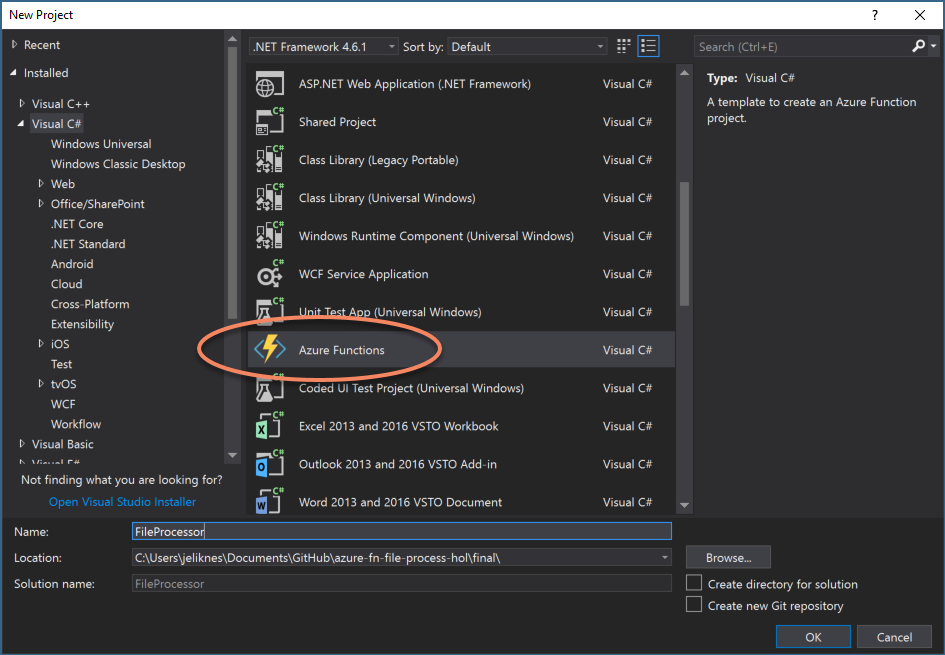
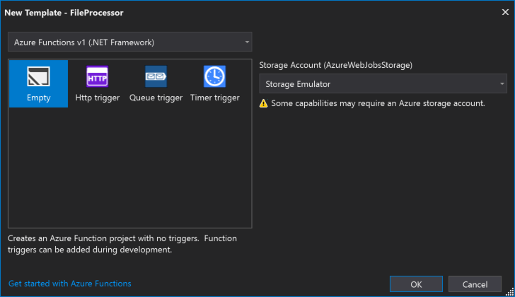

# Use Azure Functions to process a CSV File and import data into Azure SQL

> NOTE: this hands on lab is currently under development. This note will be removed when it is final.

## Introduction

## Exercises

1. [Create an Azure Functions project](#exercise1)
2. [Test the project locally](#exercise2)
3. [Create the SQL database](#exercise3)
4. [Add and test the code to update the database](#exercise4)
5. [Create an Azure SQL Database](#exercise5)
6. [Migrate the database](#exercise6)
7. [Deploy the project to Azure](#exercise7)
8. [Test a file with valid data](#exercise8)
9. [Test a file with errors](#exercise9)

<a name="exercise1"></a>

## 1. Create an Azure Functions project

This exercise will introduce you to Azure Functions and the ability to emulate storage and debug locally. The Azure Functions host makes it possible to run a fully function version of the functions host on your development machine.

### Prerequisites

* Visual Studio 2017 15.5 or later
* The Azure Development workload
* Azure Functions and Web Jobs Tools (15 or later)

### Steps

1. Open Visual Studio 2017.
2. Select `File` then `New Project` and choose the `Azure Functions` template. Enter `FileProcessor` for the `Name`.

    
3. In the Azure Functions dialog, choose the `Azure Functions v1 (.NET Framework)` host and select the `Empty` project template. Make sure that `Storage Emulator` is selected for the `Storage Account`. (This will automatically set up connection strings for storage emulation.) Click `OK` and wait for the project to create.

    
4. Right-click on the project name in the Solution Explorer and choose `Add` then `New Item...` 

    
5. Select `Azure Function` for the item and give it the name `FileProcessFn.cs` and click `Add`.

    
6. In the next dialog, choose the `Blob trigger` template. You can leave `Connection` blank or populate it with `AzureWebJobsStorage`. Type `import` for the `Path`.

    
7. When class is created, ensure it looks like this (if you did not fill out the `Connection` in the previous step, you can add it here):

    ```csharp
    namespace FileProcessor
    {
        public static class FileProcessFn
        {
            [FunctionName("FileProcessFn")]
            public static void Run([BlobTrigger("import/{name}", Connection = "AzureWebJobsStorage")]Stream myBlob, string name, TraceWriter log)
            {
                log.Info($"C# Blob trigger function Processed blob\n Name:{name} \n Size: {myBlob.Length} Bytes");
            }
        }
    }
    ```
8. In the Solution Explorer, open `local.settings.json`. It should have development storage set, like this:

    ```JavaScript
    {
        "IsEncrypted": false,
        "Values": {
            "AzureWebJobsStorage": "UseDevelopmentStorage=true",
            "AzureWebJobsDashboard": "UseDevelopmentStorage=true"
        }
    }
    ```

<a name="exercise2"></a>

## 2. Test the project locally

### Prerequisites

* Azure Storage Emulator
* Azure Storage Explorer

### Steps


<a name="exercise3"></a>

## 3. Create the SQL Database

<a name="exercise4"></a>

## 4. Add and test the code to update the database

<a name="exercise5"></a>

## 5. Create the Azure SQL Database

The first exercise will create an Azure SQL database in the cloud. This exercise uses the [Azure Portal](https://jlik.me/b7b).

### Steps

1. Choose `Create a resource` and search for or select `SQL Database`.

    
1. Enter a unique `Database name`.
2. Choose your `Azure subscription`.
3. Select the `Create new` option for `Resource group` and enter `my-todo-hol`.
4. Keep the default `Blank database` for `Select source`.
5. Click `Configure required settings` for `Server`.
6. Select `Create new server`.
7. Enter a unique `Server name`.
8. Provide a login and password. ***Note:** be sure to remember these!*
9. Pick your preferred `Location`.
10. Click the `Select` button.

    
1. Click `Pricing tier`.
2. Slide the `DTU` bar to the lowest level for this lab.

    
1. Tap `Apply`.
2. Check `Pin to dashboard`.
3. Click `Create`.

Wait for the deployment to complete (you will receive an alert) and then continue to the exercise.

<a name="exercise6"></a>

## 6. Migrate the database

<a name="exercise7"></a>

## 7. Deploy the project to Azure

<a name="exercise8"></a>

## 8. Test a file with valid data

<a name="exercise9"></a>

## 9. Test a file with errors